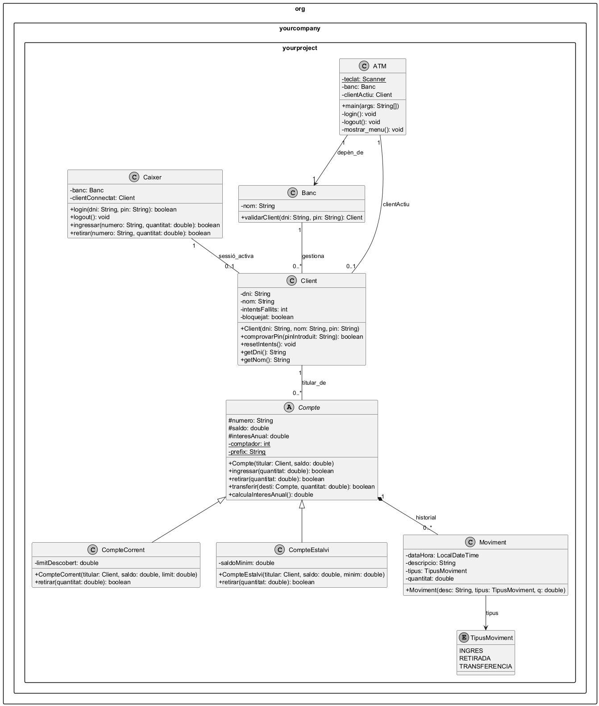
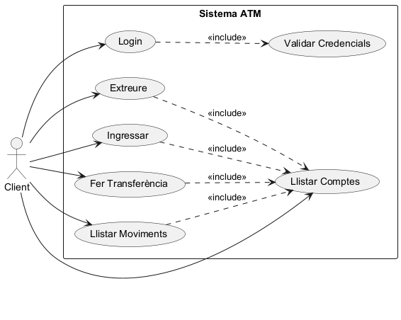
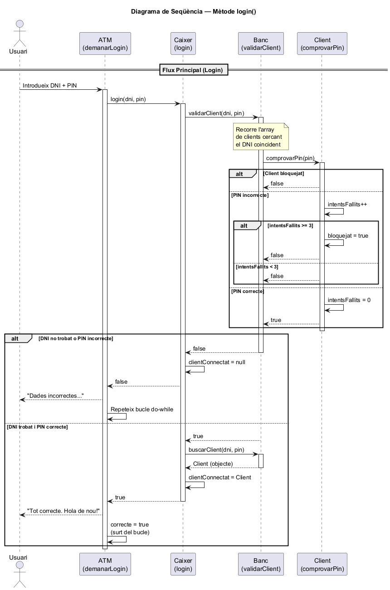
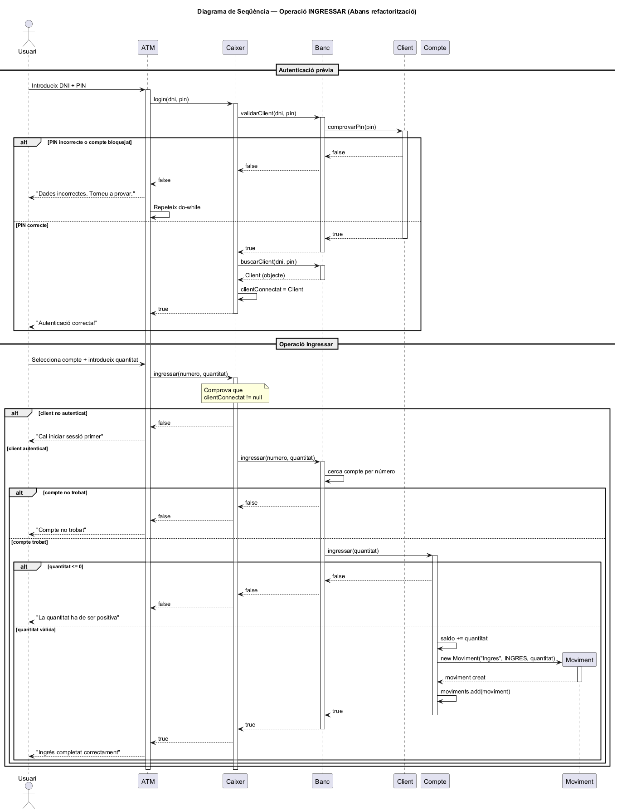
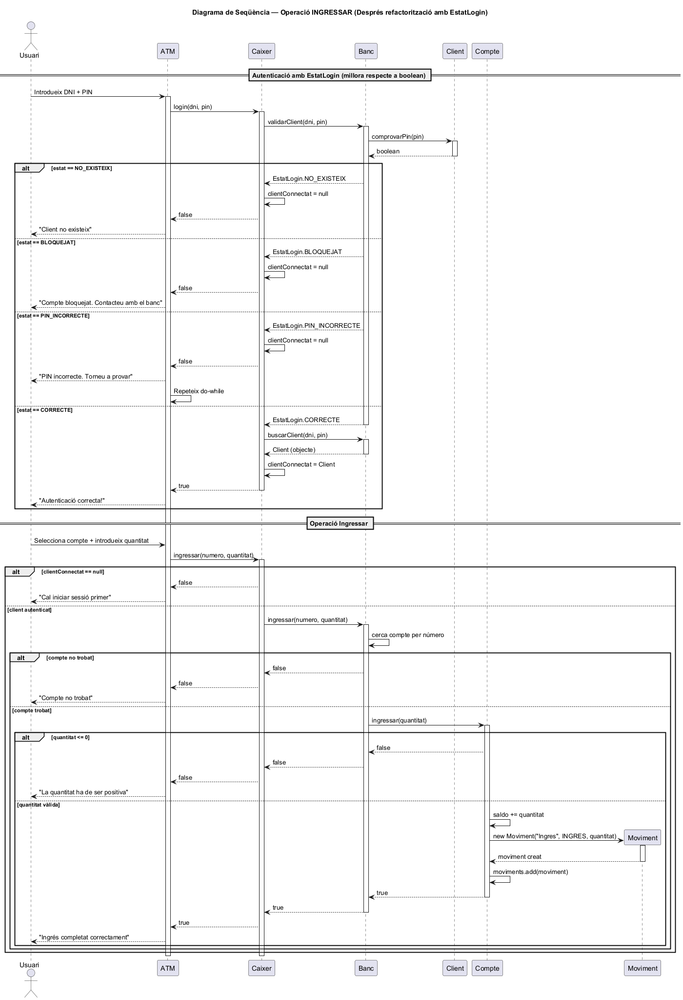

# Projecte Caixer Automàtic (POO-ATM)

Aquest projecte consisteix en una simulació d'un caixer automàtic funcional programat en **Java**, aplicant conceptes de Programació Orientada a Objectes (POO) com l'herència, el polimorfisme, l'encapsulament i la gestió d'excepcions.

## Autor
* **Joan**

---

## Diagrama de Classes (UML)

Arquitectura del sistema: jerarquia dels comptes i relacions entre els mòduls principals.



---

## Diagrama de Casos d'Ús

Mostra els actors del sistema i les operacions disponibles. La relació `<<include>>` s'utilitza per reflectir la reutilització de funcionalitats (validació de credencials i selecció de compte).



---

## Diagrama de Seqüència: LOGIN

Flux d'execució del procés d'autenticació. Mostra la crida a `validarClient()`, la validació del PIN a través de `comprovarPin()` i les branques possibles (PIN correcte, incorrecte i compte bloquejat).



---

## Diagrama de Seqüència: INGRESSAR (Abans refactorització)

Flux complet de l'operació d'ingrés: autenticació prèvia, selecció de compte, crida a `ingressar()`, actualització de saldo i creació del `Moviment`.



---

## Diagrama de Seqüència: INGRESSAR (Després refactorització amb `EstatLogin`)

Versió millorada on `validarClient()` retorna un objecte `EstatLogin` en lloc d'un booleà. El fragment `alt` mostra les 4 branques possibles: `CORRECTE`, `PIN_INCORRECTE`, `BLOQUEJAT` i `NO_EXISTEIX`.



---

## Refactorització: `validarClient()` amb `EstatLogin`

> Disponible a la branca [`refactor-login-estats`](../../tree/refactor-login-estats)

El mètode `validarClient()` de la classe `Banc` ha estat refactoritzat per retornar un `enum EstatLogin` en lloc d'un `boolean`:

```java
public enum EstatLogin {
    CORRECTE,
    PIN_INCORRECTE,
    BLOQUEJAT,
    NO_EXISTEIX
}
```

**Avantatges de la refactorització:**
- Elimina l'ambigüitat del `boolean` (que no distingeix entre "PIN incorrecte", "compte bloquejat" o "client no existeix")
- Permet gestionar cada cas de manera independent i expressiva
- Facilita l'escalabilitat del sistema (nous estats sense trencar el codi existent)
- Reutilitza `comprovarPin()` sense duplicar lògica

---

## Estructura del Projecte

El projecte està organitzat en les següents classes dins del paquet `org.yourcompany.yourproject`:

* **ATM**: Classe principal que conté el mètode `main` i gestiona la interfície d'usuari per consola.
* **Caixer**: Actua com a controlador entre la interfície i la lògica de negoci del banc.
* **Client**: Representa l'usuari, incloent validació de DNI (algoritme real) i control de seguretat del PIN.
* **Compte**: Classe base per a tots els comptes. Gestiona el saldo, el titular i l'historial de moviments.
* **CompteCorrent**: Extensió de `Compte` que permet un **límit de descobert**.
* **CompteEstalvi**: Extensió de `Compte` que obliga a mantenir un **saldo mínim**.
* **Moviment**: Registre detallat de cada operació amb marca de temps automàtica.
* **TipusMoviment** *(Enum)*: Defineix les operacions permeses: `INGRES`, `RETIRADA`, `TRANSFERENCIA`.
* **EstatLogin** *(Enum, branca refactor)*: Estats possibles del login: `CORRECTE`, `PIN_INCORRECTE`, `BLOQUEJAT`, `NO_EXISTEIX`.

---

## Funcionalitats

1. **Login Segur**: Validació de credencials amb bloqueig de compte després de 3 intents fallits.
2. **Gestió de Comptes**: Possibilitat de veure el saldo i detalls de diversos comptes.
3. **Operacions Bancàries**: Ingressos, retirades i transferències entre comptes.
4. **Historial**: Registre complet de tots els moviments realitzats durant la sessió.
