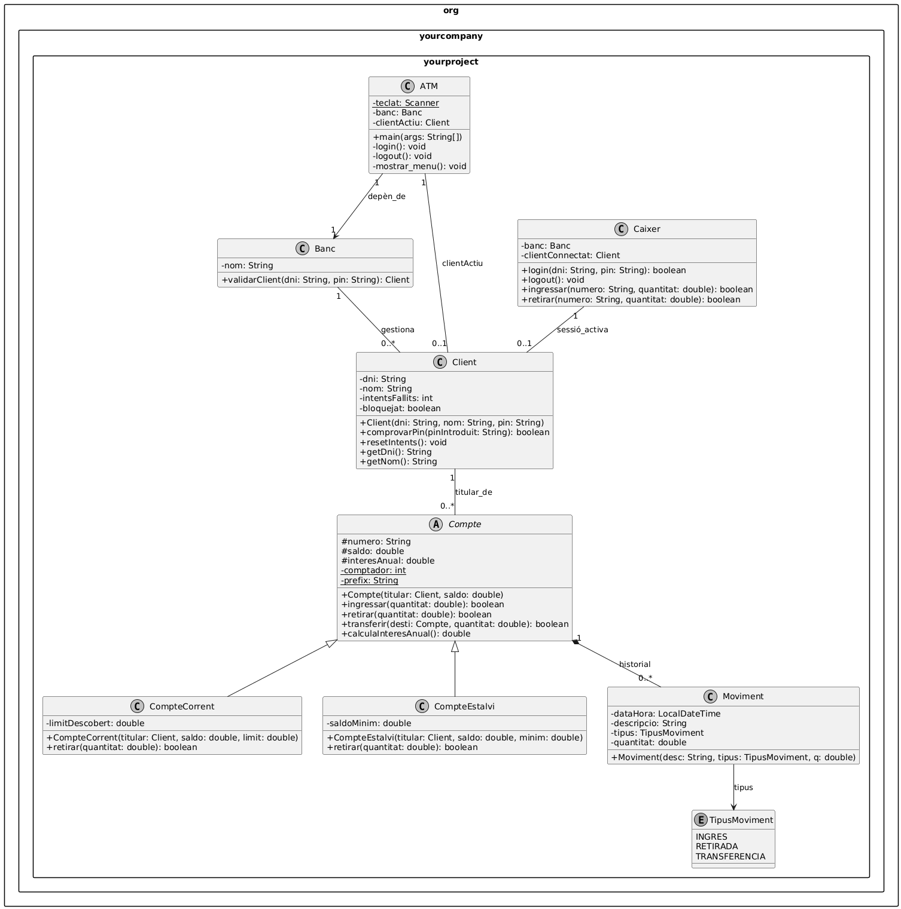
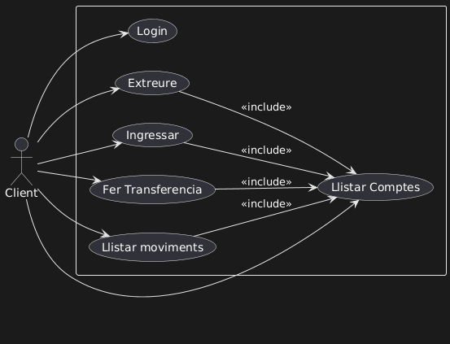
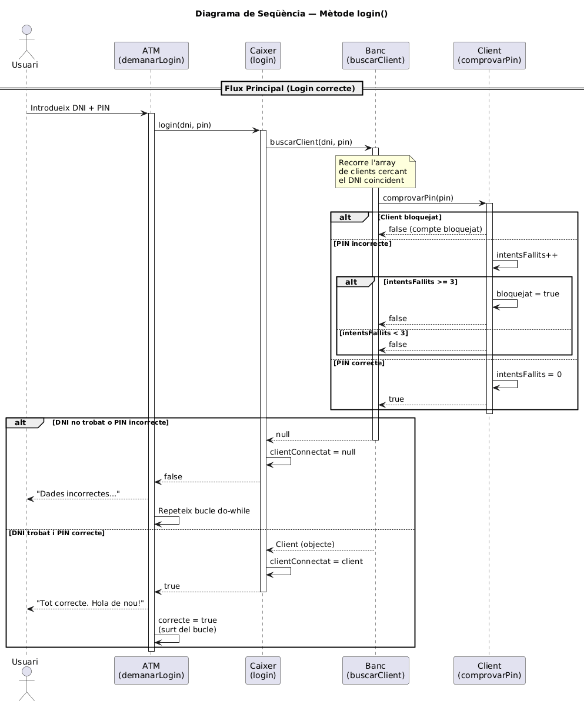
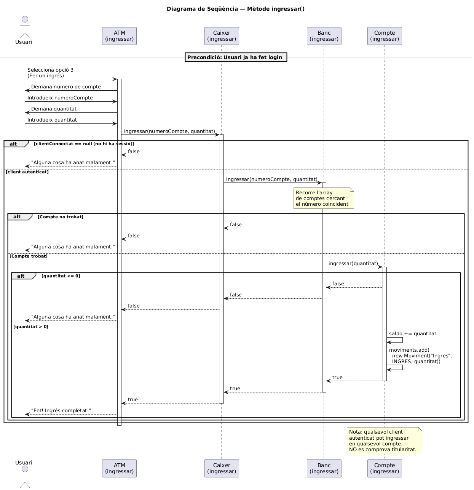

# Projecte Caixer Automàtic (POO-ATM)

Aquest projecte consisteix en una simulació d'un caixer automàtic funcional programat en **Java**, aplicant conceptes de Programació Orientada a Objectes (POO) com l'herència, el polimorfisme, l'encapsulament i la gestió d'excepcions.

## 👤 Autor
* **Joan**

## 📊 Diagrama de Classes (UML)

Aquí es mostra l'arquitectura del sistema, detallant la jerarquia dels comptes i les relacions entre els mòduls principals:

## 📊 Diagrama de Actors (UML)
Aquí es mostra l'arquitectura dels actors.

## 📊 Diagrama de FLUXE de execució LOGIN (UML)

## 📊 Diagrama de FLUXE de execució INGRESSAR (UML)

## 🛠️ Estructura del Projecte

El projecte està organitzat en les següents classes dins del paquet `org.yourcompany.yourproject`:

* **ATM**: Classe principal que conté el mètode `main` i gestiona la interfície d'usuari per consola.
* **Caixer**: Actua com a controlador entre la interfície i la lògica de negoci del banc.
* **Client**: Representa l'usuari, incloent validació de DNI (algoritme real) i control de seguretat del PIN.
* **Compte (Abstracta)**: Classe base per a tots els comptes. Gestiona el saldo, el titular i l'historial de moviments.
* **CompteCorrent**: Extensió de Compte que permet un **límit de descobert**.
* **CompteEstalvi**: Extensió de Compte que obliga a mantenir un **saldo mínim**.
* **Moviment**: Registre detallat de cada operació (Ingrés, Retirada, Transferència) amb marca de temps automàtica.
* **TipusMoviment (Enum)**: Defineix les operacions permeses: `INGRES`, `RETIRADA`, `TRANSFERENCIA`.

## 🚀 Funcionalitats
1.  **Login Segur**: Validació de credencials amb bloqueig de compte després de 3 intents fallits.
2.  **Gestió de Comptes**: Possibilitat de veure el saldo i detalls de diversos comptes.
3.  **Operacions Bancàries**: Ingressos, retirades i transferències entre comptes.
4.  **Historial**: Registre complet de tots els moviments realitzats durant la sessió.

## 🔒 Bloqueig temporal i nova validació de login

S'ha afegit una millora al procés d'autenticació:

- Primer es demana el **DNI** i es comprova que existeixi al banc (no s'aplica límit d'intents al DNI).
- Si el DNI existeix, es permeten fins a **3 intents de PIN** per aquest client.
- Si el PIN falla 3 cops, el client queda bloquejat **temporalment**. Les durades de bloqueig són escalonades segons el número de bloquejos consecutius: 1 min, 3 min, 5 min, 10 min, 30 min, 1 hora (i es manté 1 hora per a bloquejos posteriors).
- Quan el bloqueig expira, els intents es resetegen i el client pot tornar a intentar el login.

Credencials de prova incloses al banc per facilitar proves:

- `11111111H` / `1111` (Alex)
- `22222222J` / `2222` (Ana)
- `33333333P` / `3333` (Andreu)
- `44444444A` / `4444` (Pau)
- `55555555K` / `5555` (Ina)

Prova ràpida: inicia l'aplicació i introdueix un DNI d'exemple; si falles el PIN 3 vegades veuràs el missatge amb el temps restant de bloqueig.
